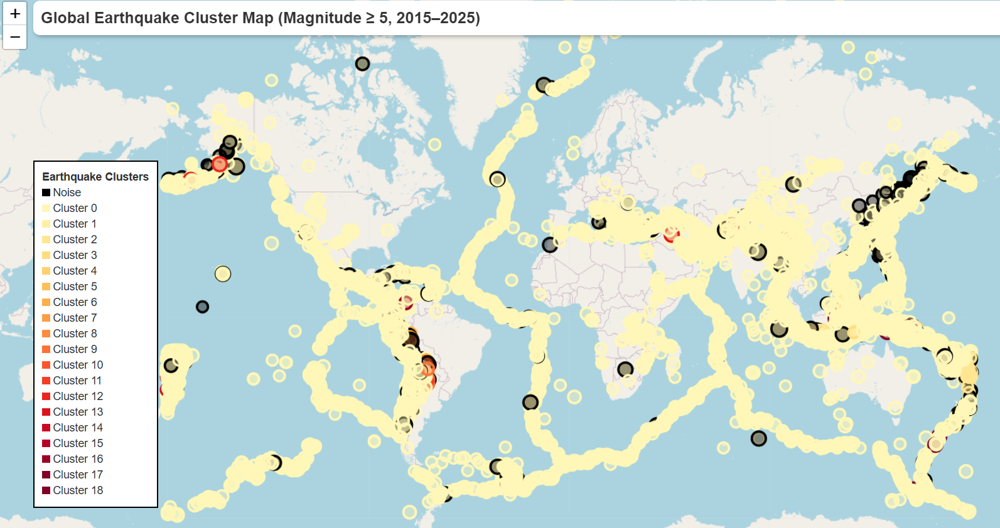

# 🌍 Earthquake Data Dashboard with Folium

## 📌 Project Overview
This project fetches global earthquake data from the USGS API, cleans it, visualizes it using Folium, and provides insights into earthquake frequency and magnitude across time and geography.




## 🔍 Features
- Dynamic magnitude-based color map (yellow → red)
- Interactive map with popups
- Summary statistics
- Modular, reusable Python scripts

## 🛠️ How to Run
```bash
python visualize_earthquakes.py ''' If you want to visualize the data, two subplots will be generated
                                    along with a Folium map in HTML. The figures are not yet programmed 
                                    with block=False, so you need to close them to complete the script execution
                                '''
python analysis.py #If you want to check the insights and summary of the data.
```
## Data Source and API
More info here https://earthquake.usgs.gov/fdsnws/event/1/
